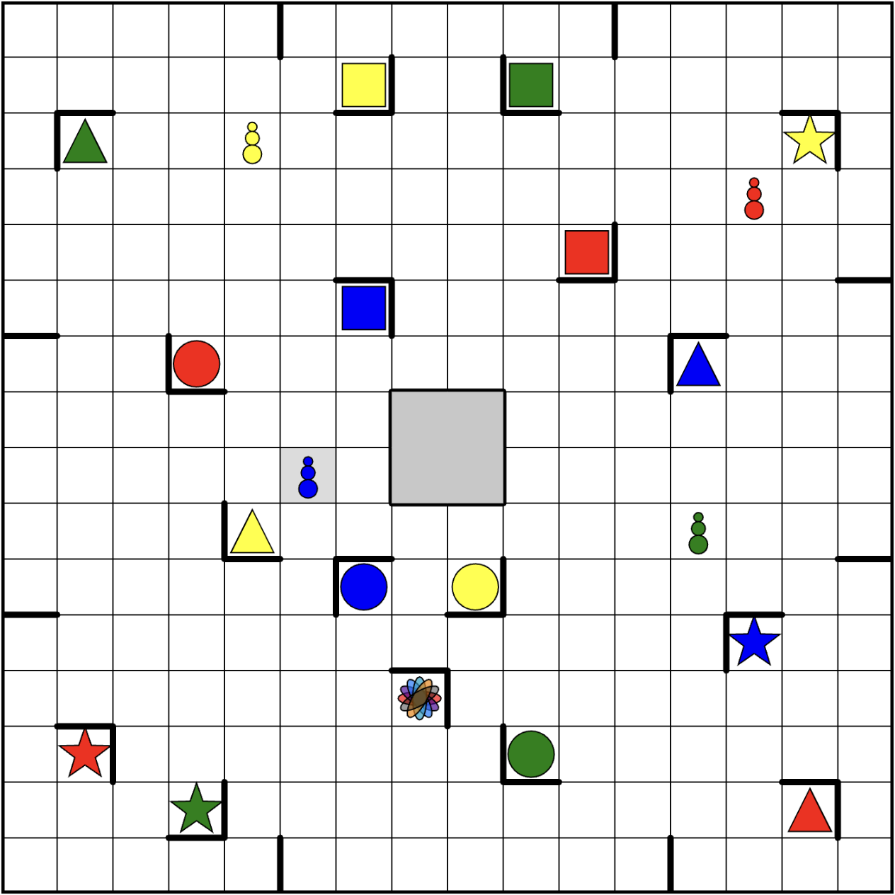

# Ricochet Robots

My (currently very WIP) [p5.js](https://p5js.org/) implementation of the out-of-print, surprisingly fun mental-shape-translation game [Ricochet Robots].(https://en.wikipedia.org/wiki/Ricochet_Robots)

*App screenshot*

*Original box art*

*Physical game*

