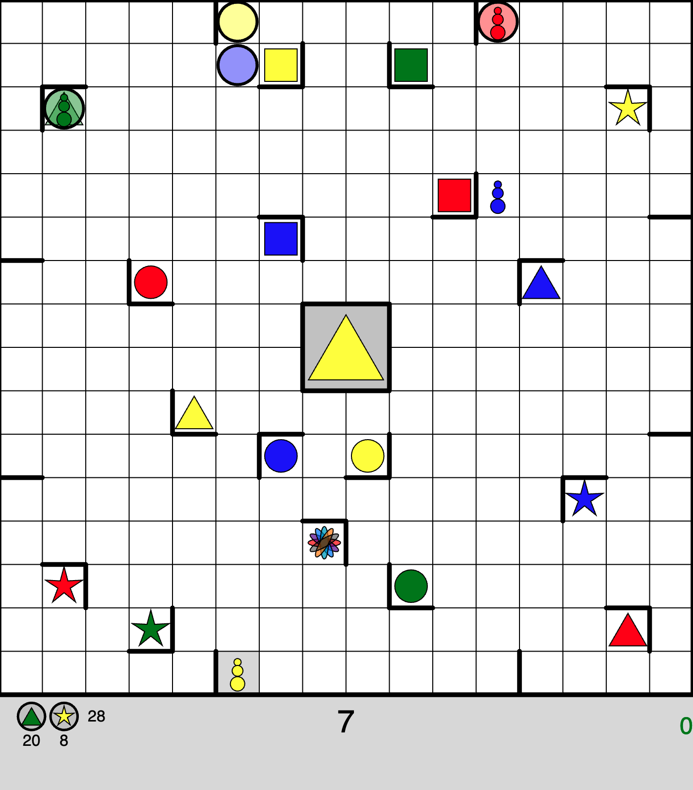
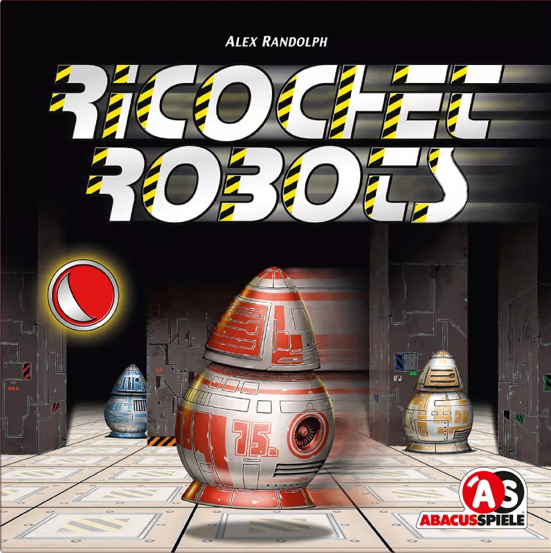
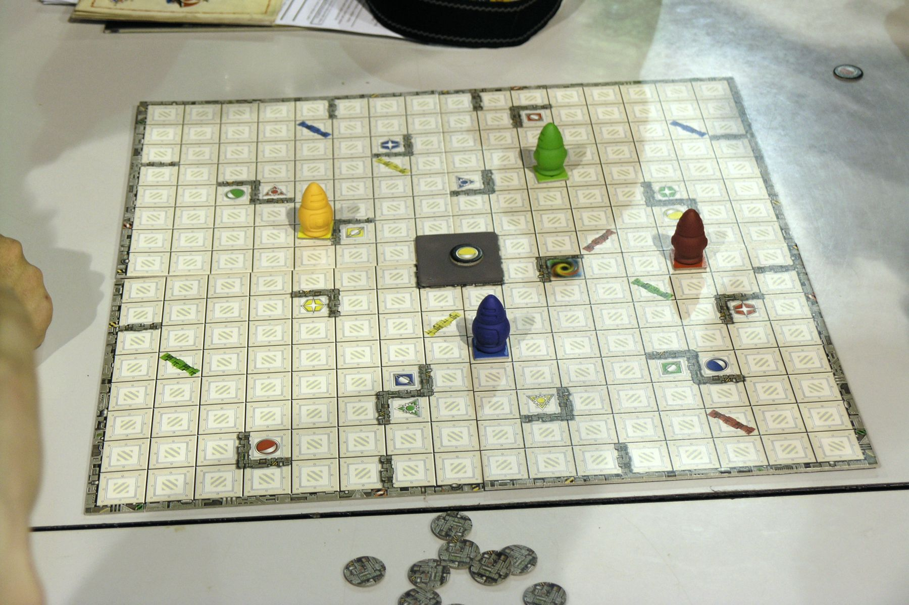

# Ricochet Robots

My (very WIP) [p5.js](https://p5js.org/) implementation of the out-of-print, surprisingly fun mental-shape-translation game [Ricochet Robots](https://en.wikipedia.org/wiki/Ricochet_Robots)

Try out the latest version on [my site](https://briansmiley.github.io/p5/ricochetrobots/) or fiddle with the code\* in in the [p5 Editor](https://editor.p5js.org/briansmiley/sketches/LJjfo8k1P)

## **Instructions**

- Click to select a robot
- `w` `a` `s` `d` or `↑` `←` `↓` `→` to move

- Robots move until they hit a wall or another robot

- Goal is to make the matching color robot reach the target shape in as few moves as possible (rainbow shape can be reached by any color).

- For multiplayer, players find solutions in their heads without moving robots on screen. Once a player claims a solution move count, start the minute timer, during which other players can propose faster solutions. Once time is up, demonstrate the fastest valid solution on screen and collect the point for the appropriate player

- `r` resets the current solution attempt

- Clicking center shape resets the turn and selects a new token (e.g. if the current target is trivial or too challenging to reach)

- Full original game instructions available [here](https://images-cdn.zmangames.com/us-east-1/filer_public/c0/b4/c0b482f1-ad3e-4e5d-ae48-0c11aa7c317a/en-ricochet_robot-rules.pdf)

- Board is shuffled on each page load!

\*as of 4/30/24

_App screenshot_

_Original box art_

_Physical game_
